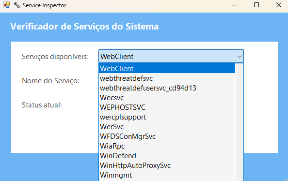
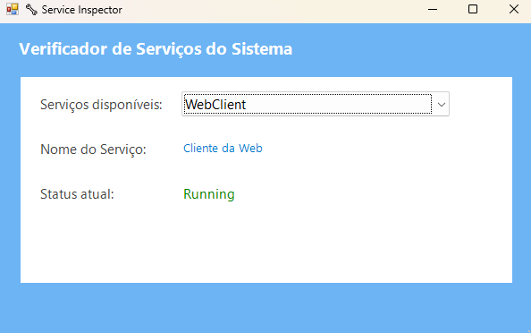
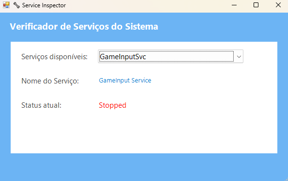

# Service Inspector - PowerShell

Desenvolvi esse projeto para práticar e aprimorar meus conhecimentos em Windows e PowerShell.

## 🚀 Funcionalidades

- ✅ Verificar status de um serviço

## Prática

Ação: Abra a droplist e selecione um serviço.

---

Retorno: Status do serviço.

---

Retorno: Status do serviço.

